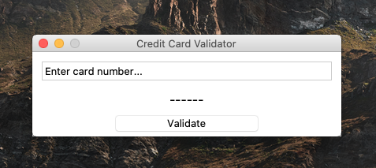
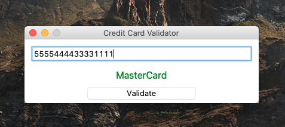
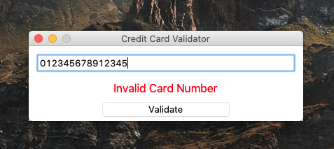

# Card Validator
- Simple Python application that I made to try out Python GUI - [tkinter](https://docs.python.org/3/library/tkinter.html)
- TO DO: Executable files
> Usage: Run -> python app.py

## Screenshots

